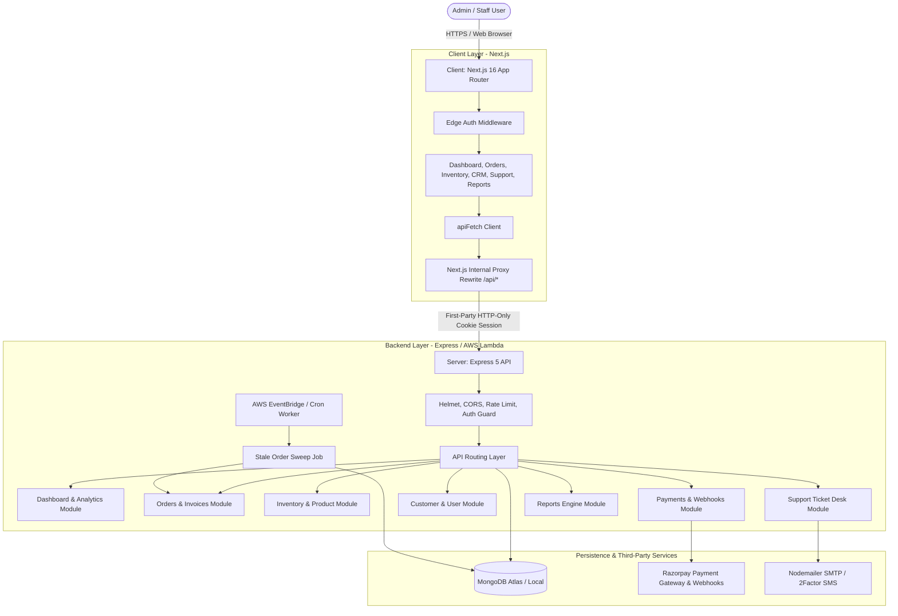

# Synera — Business Admin Dashboard & API

<div align="center">

[](https://syneraaa.vercel.app)
[](https://syneraaa.vercel.app)
[](https://nextjs.org/)
[](https://react.dev/)
[](https://tailwindcss.com/)
[](https://expressjs.com/)
[](https://www.mongodb.com/)
[](https://aws.amazon.com/lambda/)
[](https://razorpay.com/)

**The mission-critical business operations console and serverless backend engine for Synera.**

🌐 **Live Application:** [https://syneraaa.vercel.app](https://syneraaa.vercel.app)

[Overview](#-overview) • [Architecture](#-architecture) • [Features](#-core-features--modules) • [Tech Stack](#-tech-stack) • [Getting Started](#-getting-started) • [API Reference](#-api-reference) • [Deployment](#-deployment--serverless)

</div>

---

## 📌 Overview

**Synera Operations Platform** is an enterprise-grade, monorepo business operations console and RESTful API backend. It serves as the unified central hub for internal teams—including executive managers, warehouse dispatchers, support engineers, and billing administrators—to orchestrate and monitor end-to-end commerce operations.

The platform streamlines high-volume order processing, real-time inventory synchronization, customer relationship management (CRM), financial transaction reconciliation via Razorpay, and multi-tier customer support ticketing.

### Key Capabilities at a Glance

- 📊 **Executive & Business Intelligence Dashboard:** Real-time KPI summaries, revenue trajectory forecasting, regional heatmaps, and demographic analytics.
- 🛒 **End-to-End Order Management (OMS):** Full lifecycle tracking from creation, verification, barcode generation, packing, and invoicing to delivery.
- ⏱️ **Automated Stale Order Sweep:** AWS EventBridge cron worker that auto-cancels abandoned/unpaid checkouts and reclaims inventory stock.
- 📦 **Live Inventory & Catalog Management:** Real-time multi-product stock tracking with proactive low-stock threshold alerting.
- 👥 **Customer Relationship Management (CRM):** Customer 360° views, purchase histories, cart monitoring, and profile management.
- 💳 **Payments & Financial Ledger:** Seamless Razorpay integration with automated webhook ingestion, HMAC signature verification, refunds, and financial audit ledgers.
- 🎧 **Customer Support & Service Desk:** Ticket lifecycle management, support engineer assignment, audit trails, and automated email/SMS communications.
- 📑 **Invoicing & Regulatory Compliance:** Built-in GST-compliant tax invoice generation, shipping label printing with barcodes, and Excel data export.
- 🛡️ **Enterprise Security & Reliability:** JWT authentication with secure HTTP-only cookies, Next.js reverse-proxy routing (eliminating cross-domain cookie pitfalls), Helmet headers, rate limiting, and reCAPTCHA protection.

---

## 🏗️ Architecture

The repository is organized as an integrated monorepo separating the modern **Next.js 16 App Router** frontend from the **Express 5 / AWS Serverless** backend API.

```
dashboard/
├── client/                     # Next.js 16 Frontend Application
│   ├── src/
│   │   ├── app/                # Next.js App Router (Dashboard & Login routes)
│   │   │   ├── (dashboard)/    # Authenticated dashboard views (customers, inventory, orders, payments, reports, support)
│   │   │   └── login/          # Administrative authentication portal
│   │   ├── components/         # Reusable UI library (Shadcn UI, Radix primitives, branded Synera logos)
│   │   ├── config/             # Client API and Company GST/Billing configuration
│   │   ├── contexts/           # React Context providers (Auth, Navigation, State)
│   │   ├── features/           # Modular domain-driven UI views and business logic
│   │   ├── lib/                # Shared utilities, HTTP client (apiFetch), formatters
│   │   ├── middleware.js       # Route protection and cookie verification middleware
│   │   └── services/           # TanStack React Query data access layer
│   ├── next.config.mjs         # Next.js configuration & internal API proxy rewrite rules
│   └── package.json
│
├── server/                     # Express 5 & AWS Serverless Backend
│   ├── handler.js              # AWS Lambda entrypoint wrapper (serverless-http)
│   ├── server.js               # Standalone HTTP Server for local development
│   ├── app.js                  # Express application setup, security middlewares, route mounting
│   ├── serverless.yml          # Serverless Framework v3 configuration (API Gateway + EventBridge cron)
│   ├── scripts/                # Database seeding & standalone job runner scripts
│   ├── src/
│   │   ├── config/             # Database (Mongoose) and external service configurations
│   │   ├── jobs/               # Background sweep jobs (e.g., staleOrderSweep)
│   │   ├── middlewares/        # Authentication, role verification, and error handler middlewares
│   │   ├── models/             # Mongoose schemas (Admin, User, Order, Product, Payment, Invoice, SupportTicket)
│   │   ├── modules/            # Domain-driven architecture (Admin & Client modules)
│   │   │   ├── admin/          # Admin controllers & services (auth, dashboard, inventory, invoices, orders, payments, reports, support, users)
│   │   │   └── client/         # Client-facing API controllers & services (auth, orders, payments, products, profile, support)
│   │   ├── routes/             # Centralized routing registry
│   │   └── utils/              # Token generation, SMS (2Factor), Email (Nodemailer), Logger (Pino)
│   └── package.json
│
└── README.md                   # Root Project Documentation
```

### Architecture Diagram



---

## ✨ Core Features & Modules

### 1. 📊 Executive Dashboard & Analytics
- **KPI Monitoring:** Real-time aggregates for Gross Merchandise Value (GMV), net revenue, active orders, fulfilled shipments, pending support tickets, and low-inventory warnings.
- **Visual Analytics:** Interactive Recharts visualizers for Order vs. Unit volume trends, Customer Acquisition curves, Revenue Forecasts, and State/Gender distribution breakdowns.
- **Actionable Insights:** Quick feeds of recent customer actions, system alerts, and critical inventory warnings.

### 2. 🛒 Order Management System (OMS)
- **Lifecycle Tracking:** Multi-stage order workflow: `Created` $\rightarrow$ `Pending` $\rightarrow$ `Processing` $\rightarrow$ `Shipped` $\rightarrow$ `Delivered` (or `Cancelled`).
- **Barcodes & Print Labels:** Automated `jsbarcode` rendering for high-speed warehouse scanning and shipping labels.
- **Tax Invoices:** Instant PDF/printable GST invoices with dynamic CGST/SGST/IGST breakdown and company credentials.
- **Automatic Stock Reservation:** Real-time stock decrement upon order placement and atomic inventory restoration upon order cancellation.

### 3. ⏱️ Automated Stale Order Sweep (Background Job)
- **Auto-Cancellation:** AWS EventBridge triggers a sweep every 5 minutes (`rate(5 minutes)`) or via CLI script.
- **Stock Reclamation:** Scans for abandoned orders in `pending` or `payment_initiated` state exceeding the TTL threshold, transitions them to `cancelled`, and automatically replenishes reserved warehouse stock in MongoDB.

### 4. 📦 Inventory & Product Catalog
- **Stock Tracking:** Real-time unit counts, allocated quantities, threshold alerts, and SKU management.
- **Product Management:** Full CRUD capabilities for products, devices, accessories, specifications, and dynamic pricing models.
- **Low-Stock Alerts:** Automated visual and operational alerts when units drop below safety thresholds.

### 5. 👥 Customer Relationship Management (CRM)
- **Customer 360° Profile:** Comprehensive view of customer contact information, delivery addresses, order histories, and linked devices.
- **Cart Analytics:** Visibility into active in-cart items and abandoned checkout stages.
- **Filtering & Search:** Fast server-side pagination, status filters, and multi-field keyword search.

### 6. 💳 Payments & Financial Ledger
- **Razorpay Integration:** Order generation, client-side checkout initiation, payment capture, and server-side HMAC-SHA256 signature verification.
- **Webhooks Processing:** Dedicated webhook handler for asynchronous payment status updates (`payment.captured`, `payment.failed`, `refund.processed`).
- **Revenue Ledger:** Multi-dimensional revenue aggregation by payment mode, status, and time windows (daily, weekly, monthly, annual).

### 7. 🎧 Customer Support & Ticketing Desk
- **Ticketing Workflow:** End-to-end support ticket triage (`Open`, `In Progress`, `Resolved`, `Closed`).
- **Engineer Assignment:** Assign tickets to specific support engineers with priority ratings (`Low`, `Medium`, `High`, `Critical`).
- **Audit Log & Timelines:** Chronological activity log with internal agent notes and status transition history.
- **Customer Notifications:** Automated email and SMS alerts via Nodemailer and 2Factor API.

### 8. 📈 Reports & Data Exporting
- **Analytical Reports:** In-depth order volume and revenue generation breakdowns across custom date periods.
- **Spreadsheet Export:** Client-side and server-side Excel (`.xlsx`) generation for external accounting, audits, and compliance.

---

## 🛠️ Tech Stack

### Frontend (`client/`)
| Technology | Version | Purpose |
|---|---|---|
| **Next.js** | `16.2.6` | App Router, SSR, Middleware, Internal API Proxying |
| **React** | `19.2.4` | UI Component architecture |
| **Tailwind CSS** | `v4` | Modern utility-first styling |
| **Radix UI / Shadcn** | Latest | Accessible, unstyled UI primitives & component systems |
| **TanStack React Query** | `v5.101` | Asynchronous server state caching, pagination & mutations |
| **Recharts** | `v3.8` | Declarative charts and data visualization |
| **Lucide React** | `v1.17` | Consistent icon library |
| **Sonner** | `v2.0` | Toast notification system |
| **JsBarcode** | `v3.12` | Barcode generation for invoices & warehouse shipping labels |
| **XLSX** | `v0.18` | Spreadsheet generation and reporting exports |

### Backend (`server/`)
| Technology | Version | Purpose |
|---|---|---|
| **Node.js** | `v20.x` | Server JavaScript runtime |
| **Express** | `5.2.1` | REST API framework |
| **MongoDB / Mongoose**| `9.5.0` | Document database & schema ODM |
| **Serverless Framework** | `v3` | AWS Lambda & EventBridge infrastructure-as-code |
| **Serverless HTTP** | `4.0.0` | Express app adapter for AWS Lambda & API Gateway |
| **Razorpay SDK** | `2.9.6` | Payment orders, signature verification, and refunds |
| **Pino** | `10.3.1` | High-performance structured JSON logging |
| **Helmet & CORS** | `8.2.0 / 2.8.6` | HTTP security headers and cross-origin resource protection |
| **Express Rate Limit**| `8.5.2` | API rate limiting and brute-force mitigation |
| **Nodemailer** | `9.0.3` | Transactional email dispatch |
| **JSON Web Token / Bcrypt**| `9.0.3 / 6.0` | Stateless authentication, session tokens & password hashing |

---

## 🚀 Getting Started

### Prerequisites

Ensure you have the following installed on your development machine:
- **Node.js**: `v20.x` or higher (LTS recommended)
- **npm**: `v9.x` or higher
- **MongoDB**: Local MongoDB server or a MongoDB Atlas connection string

---

### Step 1: Clone the Repository

```bash
git clone https://github.com/samir-sah/dashboard.git
cd dashboard
```

---

### Step 2: Backend Setup (`server/`)

1. **Navigate to the server directory and install dependencies:**
   ```bash
   cd server
   npm install
   ```

2. **Configure Environment Variables:**
   Create a `.env` file in the `server/` directory (or duplicate `.env.example`):
   ```bash
   cp .env.example .env
   ```
   Fill in your configuration values (see [Server Environment Variables](#server-environment-variables)).

3. **(Optional) Seed Development Data:**
   ```bash
   node scripts/seed.js
   ```

4. **Start the Development Server:**
   ```bash
   npm run dev
   ```
   The backend API will run locally at **`http://localhost:4400`**.

---

### Step 3: Frontend Setup (`client/`)

1. **Open a new terminal, navigate to the client directory, and install dependencies:**
   ```bash
   cd client
   npm install
   ```

2. **Configure Client Environment Variables:**
   Create a `.env.local` or `.env` file in `client/`:
   ```env
   NEXT_PUBLIC_API_URL=http://localhost:4400
   ```

3. **Start the Next.js Development Server:**
   ```bash
   npm run dev
   ```
   The dashboard UI will be accessible at **`http://localhost:3000`**.

---

## ⚙️ Environment Configuration

### Server Environment Variables (`server/.env`)

| Variable | Type | Required | Description | Example / Default |
|---|---|:---:|---|---|
| `PORT` | Number | No | Local server port | `4400` |
| `NODE_ENV` | String | No | Application environment | `development` / `production` |
| `MONGO_URI` | String | **Yes** | MongoDB connection string | `mongodb://localhost:27017/synera` |
| `ACCESS_TOKEN_SECRET` | String | **Yes** | Secret for signing short-lived JWT access tokens | `your_access_token_secret_key` |
| `REFRESH_TOKEN_SECRET` | String | **Yes** | Secret for signing long-lived JWT refresh tokens | `your_refresh_token_secret_key` |
| `CORS_ORIGINS` | String | No | Comma-separated list of allowed origins | `http://localhost:3000,https://syneraaa.vercel.app` |
| `CLIENT_ORIGIN` | String | No | Primary frontend URL | `https://syneraaa.vercel.app` |
| `RAZORPAY_KEY_ID` | String | **Yes** | Razorpay public key ID | `rzp_test_XXXXXXXXXXXX` |
| `RAZORPAY_KEY_SECRET` | String | **Yes** | Razorpay secret key | `your_razorpay_secret` |
| `RAZORPAY_WEBHOOK_SECRET` | String | No | Razorpay webhook verification secret | `your_webhook_secret` |
| `FACTOR_API_KEY` | String | No | 2Factor SMS gateway API key | `your_2factor_api_key` |
| `SENDER_ID` | String | No | 2Factor SMS header sender ID | `SYNERA` |
| `SMTP_HOST` | String | No | Nodemailer SMTP server host | `smtp.mailgun.org` |
| `SMTP_PORT` | Number | No | SMTP port | `587` |
| `SMTP_USER` | String | No | SMTP authentication user | `postmaster@domain.com` |
| `SMTP_PASSWORD` | String | No | SMTP authentication password | `secret_password` |
| `DEMO_MODE` | Boolean | No | Enables passwordless/OTP bypass login for testing | `true` or `false` |

### Client Environment Variables (`client/.env`)

| Variable | Type | Required | Description | Example / Default |
|---|---|:---:|---|---|
| `NEXT_PUBLIC_API_URL` | String | **Yes** | Target backend API base URL (used for SSR and Next.js rewrites) | `http://localhost:4400` |
| `NEXT_PUBLIC_APP_ENV` | String | No | Client environment indicator | `development` / `production` |
| `NEXT_PUBLIC_RAZORPAY_KEY_ID` | String | No | Public Razorpay key for checkout initialization | `rzp_test_XXXXXXXXXXXX` |

---

## 🌐 API Reference

All endpoints are prefixed with `/api`.

### 1. Authentication & Admin (`/api/auth-dashboard` & `/api/auth`)
| Method | Route | Description |
|---|---|---|
| `POST` | `/api/auth-dashboard/login` | Admin login (email/password or OTP) |
| `POST` | `/api/auth-dashboard/refresh` | Refresh expired access token using refresh cookie |
| `POST` | `/api/auth-dashboard/logout` | Clears authentication cookies |
| `POST` | `/api/auth/send-otp` | Send mobile OTP for user validation |
| `POST` | `/api/auth/verify-otp` | Verify OTP and authenticate user session |

### 2. Executive Dashboard (`/api/dashboard`)
| Method | Route | Description |
|---|---|---|
| `GET` | `/api/dashboard/kpis` | Core summary metrics (revenue, orders, tickets, stock) |
| `GET` | `/api/dashboard/insight-kpis` | Detailed growth & operational KPIs |
| `GET` | `/api/dashboard/order-status` | Order distribution by status (pending, shipped, etc.) |
| `GET` | `/api/dashboard/orders-vs-units` | Comparison of order count vs total items sold |
| `GET` | `/api/dashboard/customer-growth` | Cumulative & new customer registration trends |
| `GET` | `/api/dashboard/revenue-forecast` | Projected vs actual revenue models |
| `GET` | `/api/dashboard/low-stock-products` | Top inventory items near depletion |
| `GET` | `/api/dashboard/state-orders` | Geographic order distribution by state |
| `GET` | `/api/dashboard/gender-orders` | Demographic customer segment orders |

### 3. Orders & Invoices (`/api/orders` & `/api/invoices`)
| Method | Route | Description |
|---|---|---|
| `GET` | `/api/orders` | Fetch paginated orders with multi-filter support |
| `GET` | `/api/orders/stats` | Order status counts and revenue aggregations |
| `GET` | `/api/orders/search` | Search orders by customer name, phone, order ID, or tracking ID |
| `GET` | `/api/orders/:orderId` | Retrieve full order details and item breakdown |
| `PATCH` | `/api/orders/cancelorder/:id` | Cancel order and automatically restore product stock |
| `PATCH` | `/api/orders/updateorder/:id` | Update status, shipping details, or tracking codes |
| `GET` | `/api/invoices/order/:orderId` | Retrieve or generate GST invoice for an order |
| `POST` | `/api/invoices/create/:orderId`| Create and finalize tax invoice |

### 4. Product Catalog & Inventory (`/api/product` & `/api/inventory`)
| Method | Route | Description |
|---|---|---|
| `GET` | `/api/product` | List all products with stock and pricing data |
| `GET` | `/api/product/:id` | Get individual product details |
| `POST` | `/api/product/addproduct` | Create a new catalog item |
| `PATCH` | `/api/product/:id` | Update product details, stock count, and price |
| `DELETE`| `/api/product/:id` | Archive or remove product from catalog |

### 5. Customers & Users (`/api/users`)
| Method | Route | Description |
|---|---|---|
| `GET` | `/api/users` | List customers (supports `isActive`, `isInCart`, `search`) |
| `GET` | `/api/users/:userId` | Get customer profile, delivery address, and device list |
| `PATCH` | `/api/users/update-user/:userId` | Update customer account status or details |

### 6. Payments & Reconciliation (`/api/payments`)
| Method | Route | Description |
|---|---|---|
| `POST` | `/api/payments/create-order` | Create Razorpay payment order instance |
| `POST` | `/api/payments/verify` | Verify payment signature and mark order paid |
| `POST` | `/api/payments/webhook` | Razorpay webhook receiver for async event handling |
| `GET` | `/api/payments/stats` | Payment success rates, volumes, and breakdown |
| `GET` | `/api/payments/analytics` | Granular financial performance analytics |
| `GET` | `/api/payments/failures` | List failed payment transactions and reasons |
| `POST` | `/api/payments/:id/refund` | Trigger Razorpay payment refund |

### 7. Customer Support Service Desk (`/api/support`)
| Method | Route | Description |
|---|---|---|
| `GET` | `/api/support/all-tickets` | List all support tickets with filtering & pagination |
| `GET` | `/api/support/ticket-stats` | Ticket status counts and resolution KPI averages |
| `GET` | `/api/support/engineers` | List available support engineers for assignment |
| `GET` | `/api/support/tickets/:ticketId` | Get ticket conversation history and audit log |
| `POST` | `/api/support/tickets` | Open a new customer support ticket |
| `PATCH` | `/api/support/tickets/:ticketId/assign` | Assign ticket to an engineer |
| `PATCH` | `/api/support/tickets/:ticketId/status` | Update ticket status (`open`, `in_progress`, `resolved`) |
| `POST` | `/api/support/tickets/:ticketId/note` | Append internal staff note to ticket |

### 8. Reports (`/api/reports` / `/api/admin/reports`)
| Method | Route | Description |
|---|---|---|
| `GET` | `/api/admin/reports/orders` | Exportable order metrics over period (`daily`, `weekly`, `monthly`) |
| `GET` | `/api/admin/reports/revenue` | Financial and tax ledger reports for accounting periods |

---

## ☁️ Deployment & Serverless

The backend is configured for deployment as an AWS Serverless application via the [Serverless Framework](https://www.serverless.com/).

### AWS Serverless Components
- **API Function (`handler.handler`):** AWS Lambda function backed by AWS HTTP API Gateway (v2) with CORS configuration and binary support.
- **Scheduled Stale Order Sweep (`staleOrderSweep`):** AWS EventBridge schedule running every 5 minutes (`rate(5 minutes)`), executing `src/jobs/staleOrderSweep.handler.js` to release dead inventory.

### Deploying the Backend to AWS

1. **Configure AWS Credentials:**
   ```bash
   aws configure
   ```

2. **Deploy via Serverless Framework:**
   ```bash
   cd server
   npm run deploy -- --stage prod --region ap-south-1
   ```

3. **To Remove the Cloud Stack:**
   ```bash
   npm run remove -- --stage prod
   ```

### Deploying the Frontend (Next.js)

The Next.js client is deployed to **Vercel** ([https://syneraaa.vercel.app](https://syneraaa.vercel.app)):

```bash
cd client
npm run build
npm run start
```

Ensure `NEXT_PUBLIC_API_URL` in Vercel project settings points to your deployed AWS HTTP API Gateway endpoint.

---

## 🔒 Security & Architecture Best Practices

- **Cross-Domain Cookie Authentication:** By routing API requests through Next.js proxy rewrites (`client/next.config.mjs`), cookies are treated as first-party (`SameSite=Lax`), preventing common browser cookie blockage across distinct subdomains.
- **HTTP-Only Cookies:** Sensitive authentication tokens (`admin_access_token`, `admin_refresh_token`) cannot be accessed by client-side JavaScript, guarding against XSS attacks.
- **Signature Verification:** All Razorpay payment captures and webhook requests are validated using cryptographic HMAC-SHA256 signatures before modifying database records.
- **Rate Limiting & Threat Protection:** Express rate limiting defends against brute-force attacks on login endpoints, while Helmet secures HTTP response headers.

---

## 💻 Available Scripts

### Root Directory
| Command | Description |
|---|---|
| `node make_transparent.js` | Utility script to process brand assets and transparencies |

### Client (`client/`)
| Command | Description |
|---|---|
| `npm run dev` | Start Next.js development server with hot reloading |
| `npm run build` | Compile and bundle production Next.js build |
| `npm run start` | Serve the production build |
| `npm run lint` | Run ESLint across Next.js and React components |

### Server (`server/`)
| Command | Description |
|---|---|
| `npm run dev` | Start local backend server with nodemon auto-reload |
| `npm run start` | Start standalone production Node.js server |
| `npm run check` | Run Node.js syntax check across entrypoints & job handlers |
| `npm run jobs:stale-order-sweep` | Run a one-off stale order sweep manually |
| `npm run deploy` | Deploy backend stack to AWS via Serverless |
| `npm run remove` | Teardown AWS Serverless resources |

---

## 📄 License & Ownership

Copyright © 2026 **Synera**. All rights reserved.  
*Proprietary and Confidential. Unauthorized copying, distribution, or deployment of this software is strictly prohibited.*
